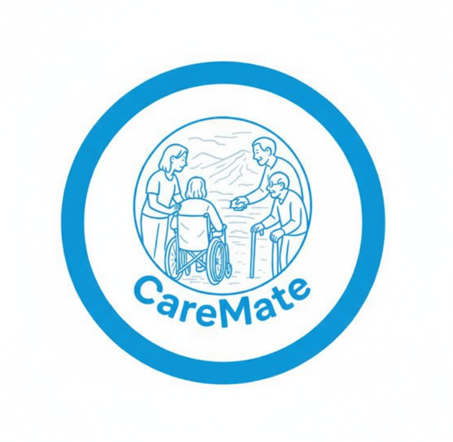

#  CareMate  
*Assistive Mobile App for Persons with Disabilities*
 

  
> Developed under the guidance of **Dr. Subhra Mazumdar**, IIT Indore.

---

## Overview

**CareMate** is a voice-first assistive Android application designed to help persons with disabilities perform essential daily tasks independently.
The app focuses on accessibility, simplicity, and safety, enabling users to interact through voice, touch, vibration, and visual cues.

---

## Features

-  **Voice-Controlled Navigation**
-  **Text-to-Speech (TTS)**
-  **Speech-to-Text (STT)**
-  **Smart Reminders**
-  **SOS Alert System**
-  **Live Location Sharing**
-  **Accessible Manual Mode**

---

##  Tech Stack

| Layer       | Technology                     |
|-------------|-------------------------------|
| Frontend    | React Native (Expo)       |
| Backend & Auth     | Supabase (PostgreSQL, OAuth, RLS)   |
| Voice Processing  |react-native-voice, expo-speech                    |
| Location & Permissions        | Expo SDK                |

##  Screenshots

<table>
  <tr>
    <td></td>
    <td></td>
     <td></td>
    <td></td>
  </tr>
  <tr>
    <td></td>
    <td></td>
    <td></td>
     <td></td>
  </tr>
  <tr>
    <td></td>
    <td></td>
    <td></td>
    <td></td>
    
  </tr>
</table>

---

